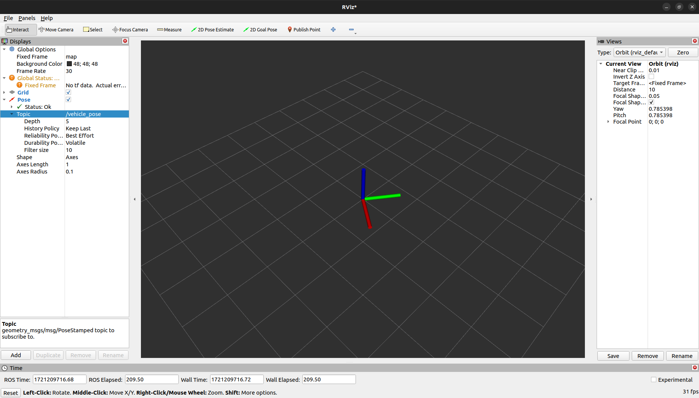

# PX4 Position Visualizer

This project utilizes PX4 Cube Orange along with ROS2. Communication between ROS2 and PX4 uses middleware that implements the XRCE-DDS protocol. This project demonstrates visualizing the Cube's orientation on RViz. It also eliminates the need for Mavlink which was required for ROS1.

To understand how ROS2 works with PX4 please refer [ROS 2 User Guide ](https://docs.px4.io/main/en/ros2/user_guide.html)

## Installation

### Install ROS2 Humble

Follow the installation instructions at: [ROS2 Humble Installation Guide](https://docs.ros.org/en/humble/Installation.html)

### Setup Micro XRCE-DDS Agent & Client
```bash
git clone https://github.com/eProsima/Micro-XRCE-DDS-Agent.git
cd Micro-XRCE-DDS-Agent
mkdir build
cd build
cmake ..
make
sudo make install
sudo ldconfig /usr/local/lib/
```
## Setup

You can either use PX4 hardware or a PX4 simulator. For simulator setup, refer to: [PX4 Simulator Setup](https://docs.px4.io/main/en/dev_setup/building_px4.html)

### PX4 Hardware Setup

1) Connect an FTDI Connector to the TELEM1 port.
2) Install QGroundControl from: [QGroundControl Installation Guide](https://docs.qgroundcontrol.com/master/en/qgc-user-guide/getting_started/download_and_install.html)

### Parameters to be Configured

1) Disable MAVLink.
2) Enable XRCE-DDS client in the TELEM1 port.
3) Set the TELEM1 port's baud rate to 57600.

## Usage

### Start the Micro XRCE-DDS Agent

If using PX4 hardware:

```bash
sudo MicroXRCEAgent serial --dev /dev/ttyUSB0 -b 57600
```

Replace "/dev/ttyUSB0" with your specific device.

If using the simulator, use UDP:

```bash
MicroXRCEAgent udp4 -p 8888
```

### Start the Visualization Node

```bash
ros2 run px4_visualize visualize_node
```

### Start RViz

```bash
rviz2 rviz2
```

#### RViz Settings

1. Add -> Odometry
2. Under Odometry:
   - Shape -> Axes
   - Reliability property -> Best Efforts
   - Topic -> vehicle_pose




## Note
This project does not utilize a GPS; hence, you will only get orientation. However, with slight modifications in the code and with the help of GPS, you will be able to get position as well.

This project was performed using Cube Orange and cannot guarantee it working on other PX4 hardware. Feel free to add necessary modifications.